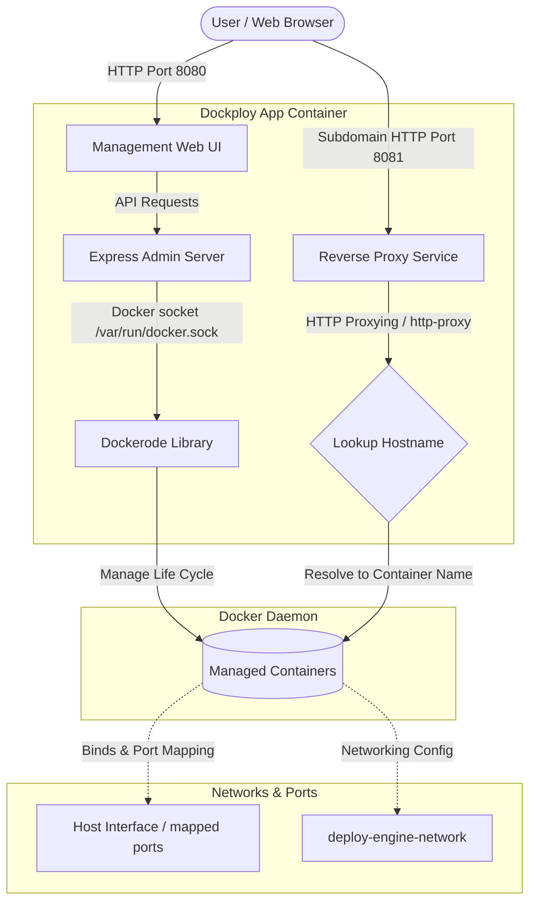

# Dockploy

Dockploy is a lightweight container deployment and reverse proxy engine. It allows developers to pull images directly from Docker Hub, configure port mapping, inject environment variables, mount volumes, set custom start commands, specify restart policies, and manage container life cycles from an elegant web dashboard. 

Additionally, it automatically runs an HTTP reverse proxy that routes subdomain traffic to your active HTTP-based web containers.

---

## System Architecture



---

## Features

- **Direct Docker Hub Pulling**: Enter any public repository image and tag, and Dockploy pulls it on-demand.
- **Port Mapping**: Map internal container ports to arbitrary external host ports perfectly.
- **Environment Variable Injection**: Define variables (one per line) to configure databases, keys, or passwords.
- **Persistent Storage (Volumes)**: Mount host directories to container paths to persist state across container removals.
- **Custom Start Commands**: Support running containers that require custom CLI parameters (e.g. `python -m http.server 8080`).
- **Restart Policies**: Set restart rules (`always`, `unless-stopped`, `on-failure`) to ensure high availability.
- **Configurable Auto-Remove**: Toggle whether stopped/failed containers are automatically removed by Docker, aiding in troubleshooting.
- **Automatic Reverse Proxying**: Routes domain subdomains dynamically (e.g. `http://my-container.100.93.190.2.nip.io:8081`) to the appropriate running web container.

---

## Getting Started

### Prerequisites
- Docker
- Docker Compose

### Running Dockploy
1. Clone the repository and navigate to the project directory:
   ```bash
   cd Dockploy
   ```

2. Start the Dockploy services using Docker Compose:
   ```bash
   docker compose up -d --build
   ```

3. Access the services:
   - **Management UI**: [http://localhost:8080](http://localhost:8080)
   - **Reverse Proxy Gateway**: `*.100.93.190.2.nip.io:8081`

---

## Deployment Configuration Examples

### 1. Web Service (e.g., Nginx)
* **Docker Image**: `nginx`
* **Tag**: `alpine`
* **Container Port**: `80`
* **Host Port**: *(leave blank to let reverse proxy handle routing)*

### 2. Database with Persistent Storage (e.g., PostgreSQL)
* **Docker Image**: `postgres`
* **Tag**: `alpine`
* **Container Port**: `5432`
* **Host Port**: `5432`
* **Environment Variables**:
  ```text
  POSTGRES_PASSWORD=mysecurepassword
  ```
* **Volumes**:
  ```text
  /path/to/host/postgres_data:/var/lib/postgresql/data
  ```
* **Restart Policy**: `always`
* **Auto Remove**: Unchecked (disabled)

### 3. Custom Language Script (e.g., Python Web Server)
* **Docker Image**: `python`
* **Tag**: `alpine`
* **Container Port**: `8000`
* **Command**: `python -m http.server 8000`
